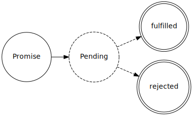

Promises
========

:author: Damián Franco Álvarez
:date: 2014/02/15

CPS
+++

- Inverts the chain of responsability

- Contagious

- Pyramid of DOOM / Callback hell

- Readability (type signatures?)

- Modularity (composition?)

- ``goto`` style

What is a promise?
++++++++++++++++++

- Uninverts the chain of responsability

- Highly composable

- Encapsulates a future value/error

CPS - code
++++++++++

::

	fs = require "fs"

	extendArrayOfCollections = (array) ->
		r = {}
		r[k] = v for k, v of dict for dict in array
		return r

	fs.readFile "1.json", enconding: "utf8", (err, data) ->
		if err
			console.error err
		else
			try
				result1 = JSON.parse data
				fs.readFile "2.json", enconding: "utf8", (err, data) ->
					if err
						console.error err
					else
						try
							result2 = JSON.parse data
							result  = extendArrayOfCollections [result1, result2]
							console.log result
						catch ex
							console.error ex
			catch ex
				console.error ex

CPS to Promises
+++++++++++++++

::

	fs = require "fs"
	P  = require "pacta"

	extendArrayOfCollections = (array) ->
		r = {}
		r[k] = v for k, v of dict for dict in array
		return r

	readFile = (filename) ->
		promise = new P
		fs.readFile filename, enconding: "utf8", (err, data) ->
			if err
				promise.reject err
			else
				promise.resolve data
		return promise

	parseStr = (str) ->
		promise = new P
		try
			result = JSON.parse str
			promise.resolve result
		catch e
			promise.reject e
		return promise

Promises - code
+++++++++++++++

::

	p1 = readFile("1.json").chain parseStr
	p2 = readFile("2.json").chain parseStr
	p3 = P.of([]).append(p1).append(p2)
	p3.map(extendArrayOfCollections).then console.log, console.error

Promises - code
+++++++++++++++

::

	p1 = readFile("1.json").chain parseStr
	p2 = readFile("2.json").chain parseStr
	p3 = readFile("3.json").chain parseStr
	p4 = P.of([]).append(p1).append(p2).append(p3)
	p4.map(extendArrayOfCollections).then console.log, console.error

Promises - code
+++++++++++++++

::

	filenames = ["1.json", "2.json", "3.json"]
	arrayOfPromises = [P.of []].concat filenames.map (filename) ->
		readFile(filename).chain parseStr

	promiseOfArray = arrayOfPromises.reduce (a,b) -> a.append b
	promiseOfArray.map(extendArrayOfCollections).then console.log, console.error

Promise libraries
+++++++++++++++++

- `List of implementations <https://github.com/promises-aplus/promises-spec/blob/master/implementations.md>`_
- Promises/A+
- Q.js
- Promise.coffee
- **Pacta**